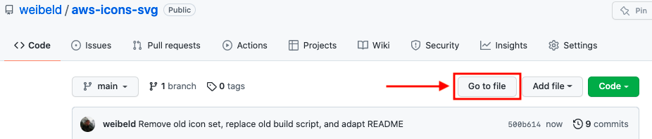
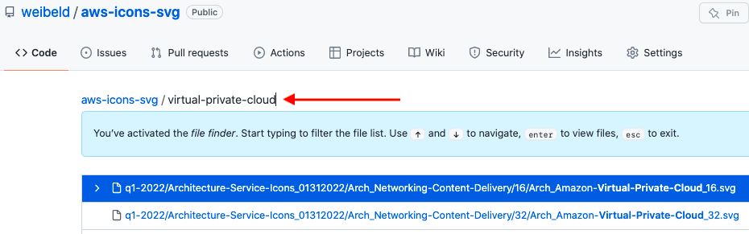

# AWS Icons SVG

The official AWS icon set in SVG format.

## Description

The [q1-2022](q1-2022) directory in this repository contains the current official [AWS architecture icon set](https://aws.amazon.com/architecture/icons/) in SVG format.

The [misc](misc) directory contains some additional icons that are not part of the official AWS icon set, but that may also be useful in AWS architecture diagrams.

> The official AWS icon set is obtained with the [`build.sh`](build.sh) script.

## Usage

To find a specific icon, best use the **Go to file** function of GitHub:

And then just start typing the name of the service or resource that you're looking for:

## Versions

Current and past versions of icon set.

| Version      | Directory | Current | URL |
|--------------|-----------|:-------:|-----|
| **01312022** | [q1-2022](q1-2022) | ✅ | https://d1.awsstatic.com/webteam/architecture-icons/q1-2022/Asset-Package_01312022.735e45eb7f0891333b7fcce325b0af915fd44766.zip |
| **20210131** | | | https://d1.awsstatic.com/webteam/architecture-icons/q1-2021/AWS-Architecture_Asset-Package_20210131.a41ffeeec67743738315c2585f5fdb6f3c31238d.zip |
