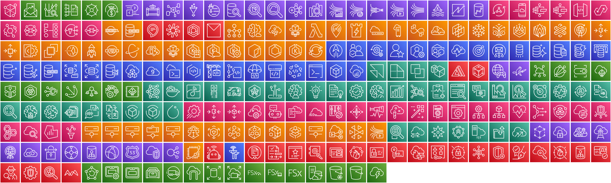
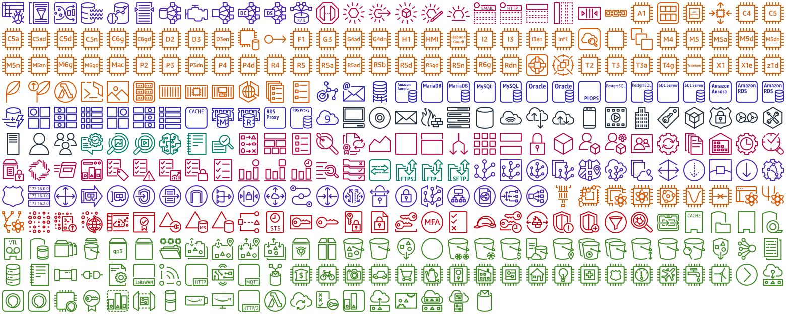

# AWS Architecture Icons

This repository contains all the AWS architecture icons from the official [AWS architecture icon assets package](https://aws.amazon.com/architecture/icons/) in SVG format.

It is essentially the AWS architecture icons assets package cleaned out so that only the SVG versions of the icons remain.

## icons

**Services:**



**Resources:**



**Categories:**


## Versions

Current and past versions of the [AWS architecture icons assets package](https://aws.amazon.com/architecture/icons/):

| Version      | URL |
|--------------|-----|
| **20210131** | https://d1.awsstatic.com/webteam/architecture-icons/q1-2021/AWS-Architecture_Asset-Package_20210131.a41ffeeec67743738315c2585f5fdb6f3c31238d.zip |


## Generate images

To generate the icon grid images, extract all PNG versions of the icons (instead of SVG) of a specific size with the `build.sh` script, then use the [ImageMagick](https://imagemagick.org/index.php) `montage` command along the following lines:

```bash
montage -tile 30x0 -geometry +2+2 -scale 80x80 */*.png out.png
```
